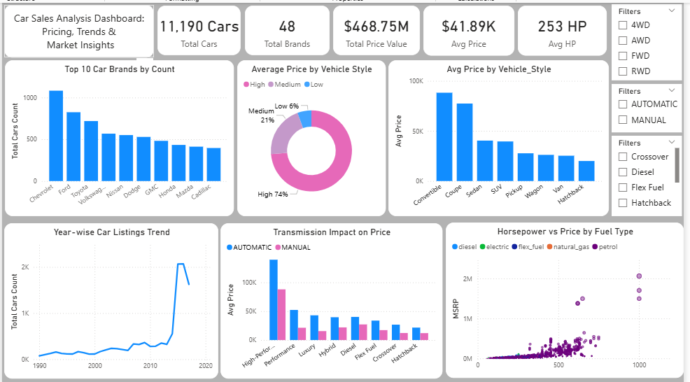

# 🚗 Car Sales Analysis Dashboard

## 📊 Python + Power BI Project | Data Cleaning | EDA | Data Visualization

An end-to-end **Car Sales Analysis Dashboard** project built using **Python** for data cleaning, preprocessing, and analysis, and **Power BI** for interactive dashboard visualization.

This project provides insights into car pricing, market trends, vehicle styles, fuel types, horsepower impact, and brand-wise sales analysis.

---

# 📌 Overview

This project focuses on analyzing car sales and market trends using Python and Power BI.

The workflow includes:

* Data Cleaning using Python
* Data Preprocessing & Feature Engineering
* Exploratory Data Analysis (EDA)
* Business Insight Generation
* Interactive Dashboard Development in Power BI

The dashboard helps understand pricing trends, vehicle performance, transmission impact, and brand popularity through dynamic visualizations.

---

# ❓ Problem Statement

Car market datasets often contain large volumes of data with inconsistent formatting, missing values, and multiple vehicle attributes.

The objective of this project is to:

✔ Clean and preprocess raw car sales data using Python
✔ Perform exploratory data analysis to uncover trends
✔ Analyze pricing patterns and vehicle performance
✔ Compare vehicle styles and fuel types
✔ Build an interactive Power BI dashboard for business insights

---

# 🗂️ Dataset Information

The dataset contains car market and sales-related information with the following fields:

* Car Brand
* Vehicle Style
* Transmission Type
* Fuel Type
* Horsepower (HP)
* MSRP (Price)
* Drivetrain
* Year
* Total Listings

The dataset was cleaned and transformed before visualization.

---

# 🛠️ Tools & Technologies Used

## 🔹 Python

* Pandas
* NumPy
* Matplotlib
* Seaborn

## 🔹 Power BI

* Power Query
* DAX
* Interactive Dashboarding
* KPI Cards
* Slicers & Filters

---

# ⚙️ Project Workflow

## 1️⃣ Data Cleaning (Python)

* Removed duplicate records
* Handled missing values
* Corrected inconsistent formatting
* Processed categorical variables

## 2️⃣ Data Preprocessing

* Feature engineering
* Data transformation
* Data type conversion
* Outlier handling

## 3️⃣ Exploratory Data Analysis (EDA)

Performed analysis on:

* Brand-wise car counts
* Price distribution
* Horsepower trends
* Fuel type analysis
* Vehicle style comparison
* Transmission impact on pricing

## 4️⃣ Dashboard Development (Power BI)

Built an interactive dashboard with:

* KPI Cards
* Trend Charts
* Scatter Plots
* Bar Charts
* Donut Charts
* Dynamic Filters

---

# 📊 Dashboard Features

## ✅ KPI Cards

* Total Cars
* Total Brands
* Total Price Value
* Average Price
* Average Horsepower

## ✅ Interactive Filters

* Drivetrain Type
* Transmission Type
* Vehicle Style

## ✅ Visualizations

* Top 10 Car Brands by Count
* Average Price by Vehicle Style
* Year-wise Car Listings Trend
* Transmission Impact on Price
* Horsepower vs Price by Fuel Type

---

# 📷 Dashboard Preview

<p align="center">
  
</p>

---

# 💡 Key Insights

📌 Total dataset contains **11,190 cars** across **48 brands**.

📌 Total market value exceeded **$468.75M**.

📌 Average vehicle price was approximately **$41.89K**.

📌 Average horsepower recorded was **253 HP**.

📌 Chevrolet and Ford had the highest number of car listings.

📌 Convertible and Coupe vehicle styles showed higher average prices.

📌 Automatic transmission vehicles generally had higher pricing trends.

📌 Strong positive relationship observed between horsepower and vehicle price.

📌 Petrol fuel type dominated the dataset distribution.

---

# 🚀 Conclusion

This project demonstrates how Python and Power BI can be combined to create a complete data analytics workflow.

Python was used for:

* Data cleaning
* Preprocessing
* Exploratory analysis

Power BI was used for:

* Dashboard visualization
* Interactive reporting
* Business insight presentation

The dashboard enables efficient market analysis and supports data-driven decision-making in the automobile domain.

---

# 📁 Project Structure

```bash
Car_Sales_Analysis/
│
├── Dataset/
│   └── car_sales_data.csv
│
├── Python/
│   └── data_cleaning_analysis.ipynb
│
├── PowerBI/
│   └── car_sales_dashboard.pbix
│
├── Images/
│   └── dashboard.png
│
└── README.md
```

---

# ⭐ Skills Demonstrated

* Data Cleaning & Preprocessing
* Exploratory Data Analysis (EDA)
* Feature Engineering
* Data Visualization
* Power BI Dashboard Development
* Business Intelligence Reporting
* Analytical Thinking
* Insight Generation

---

# 🔗 Author

**Tharun Shree**

Aspiring Data Analyst | Python | SQL | Power BI | Excel

# 🔗 Connect With Me

- LinkedIn: www.linkedin.com/in/tharunshree
